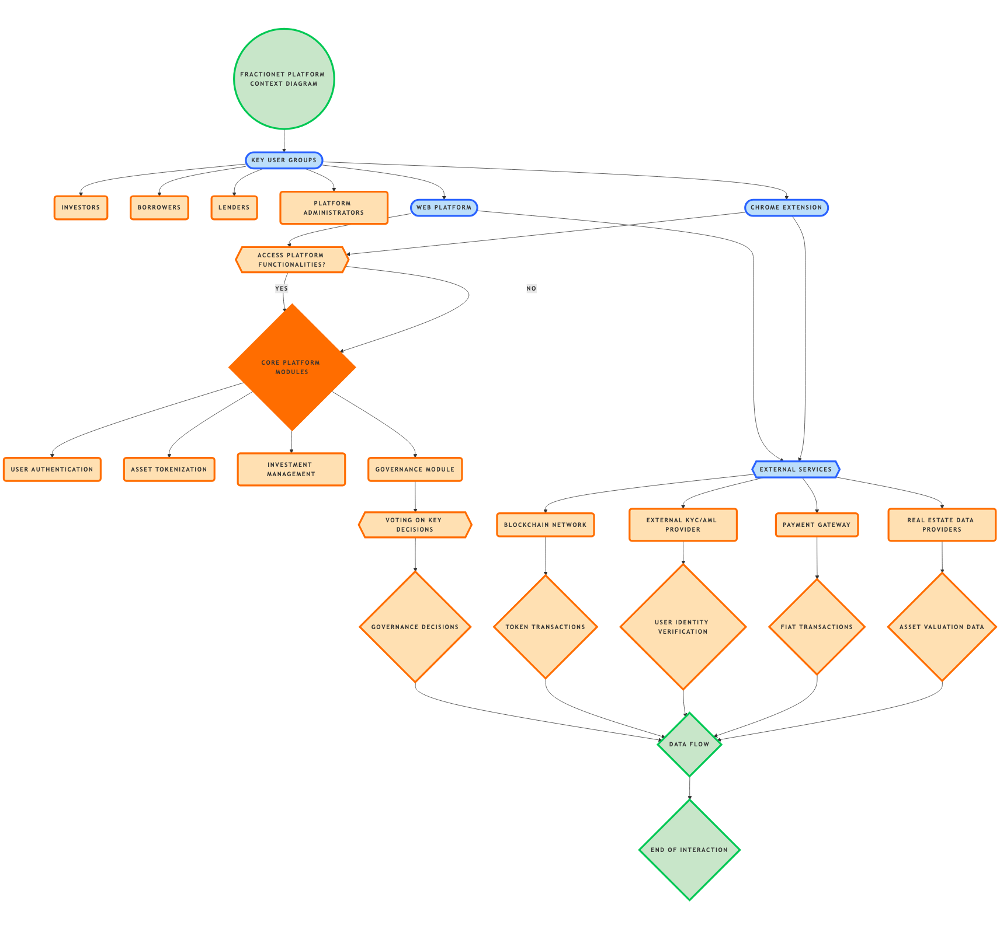
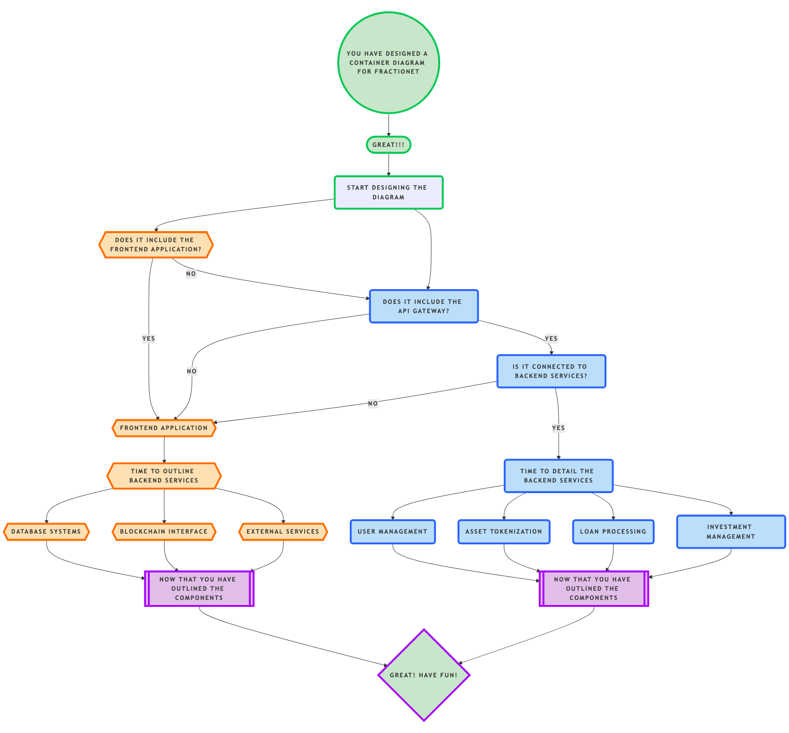
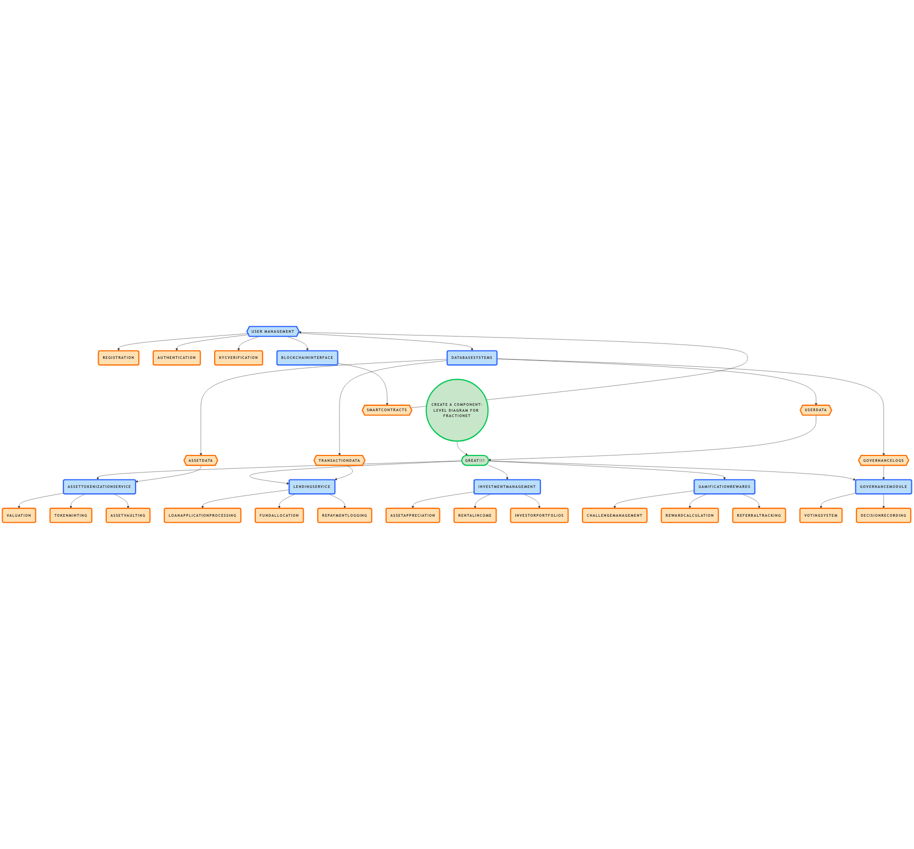
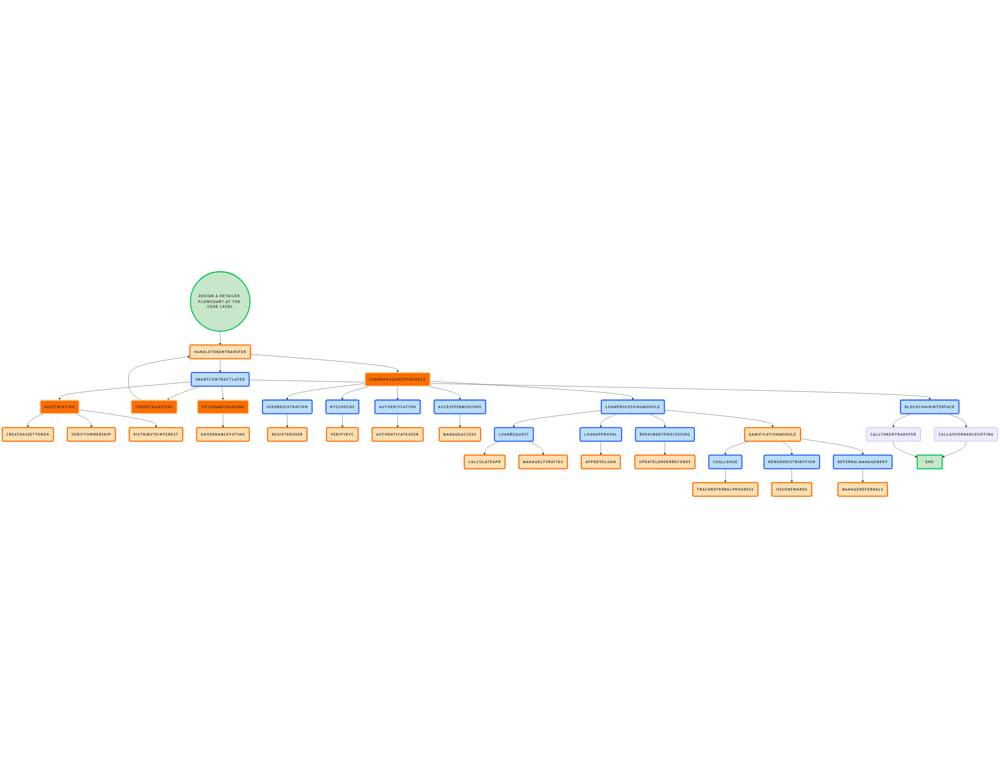
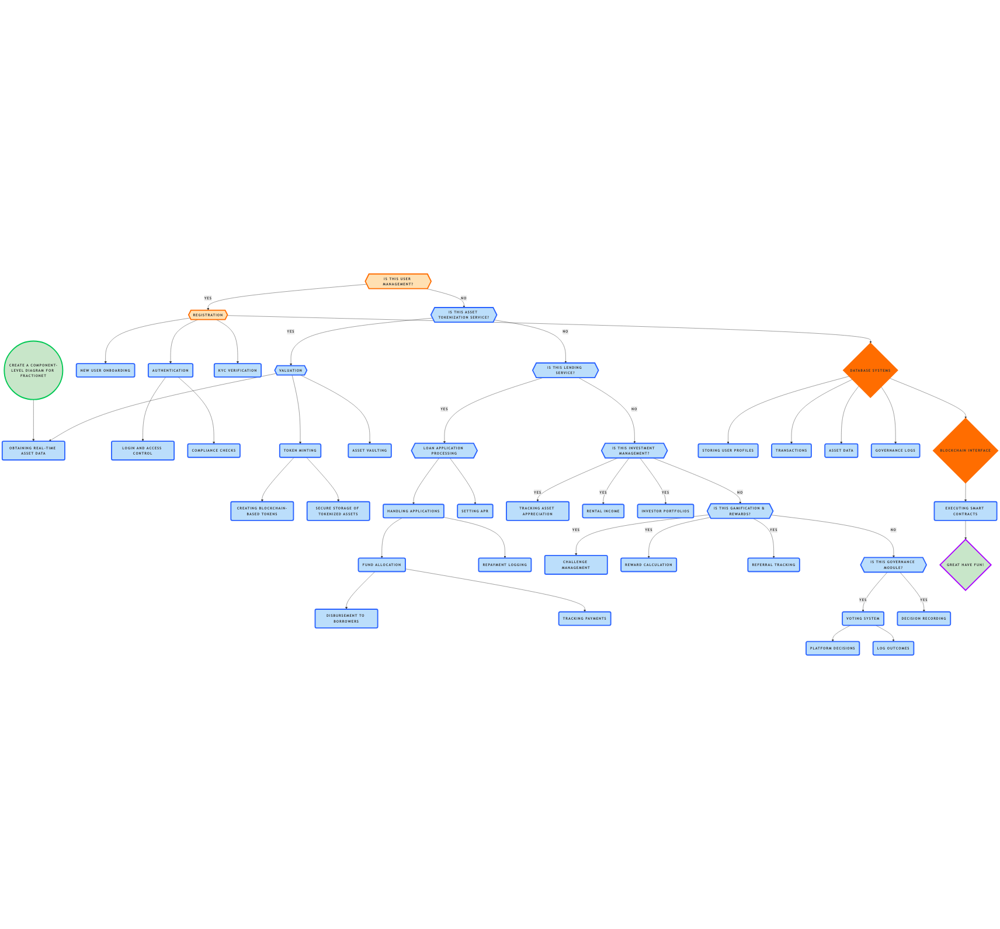
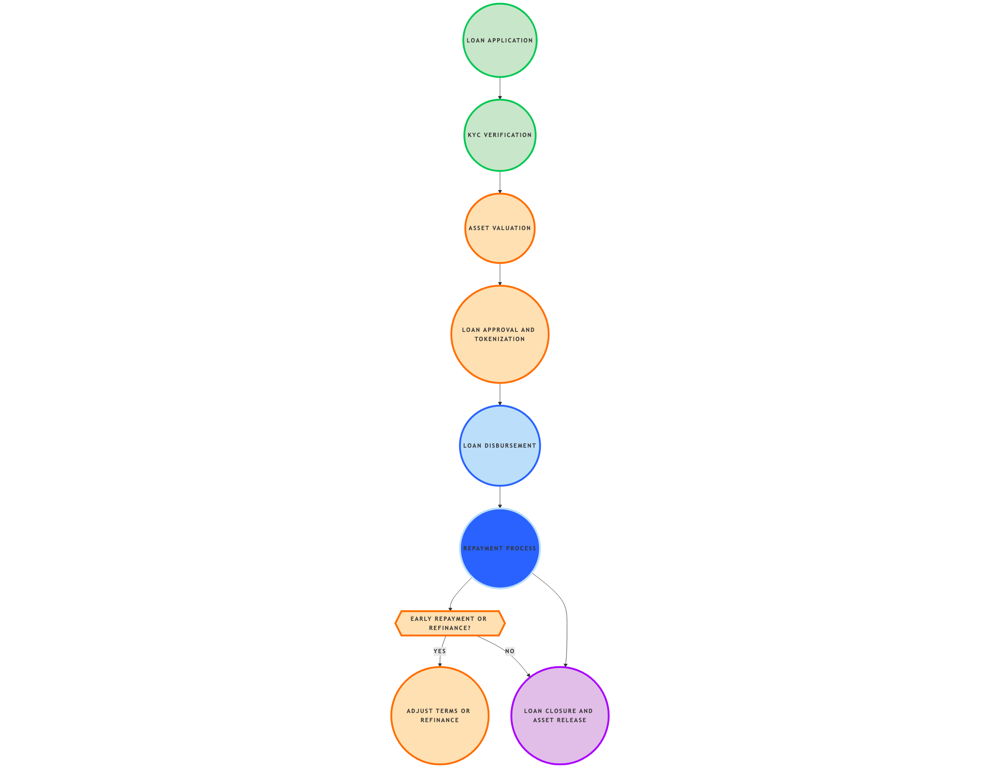
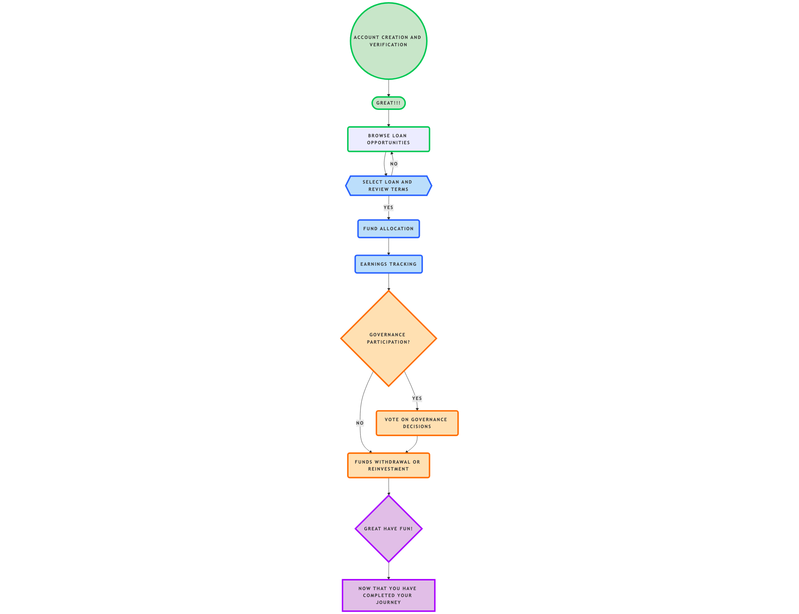
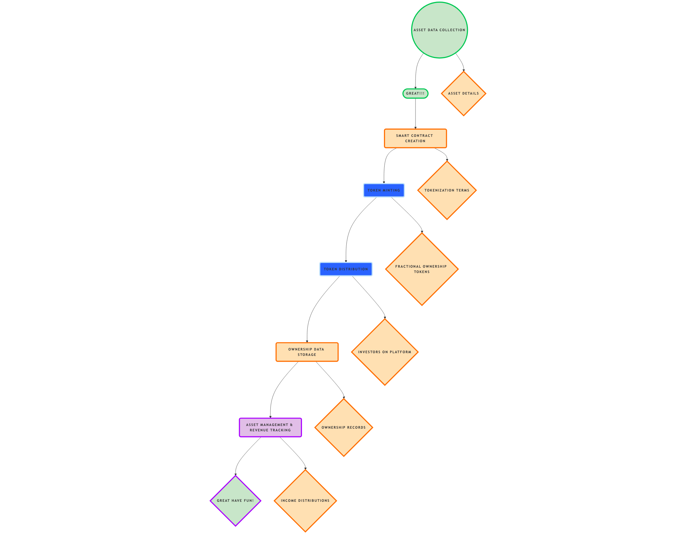
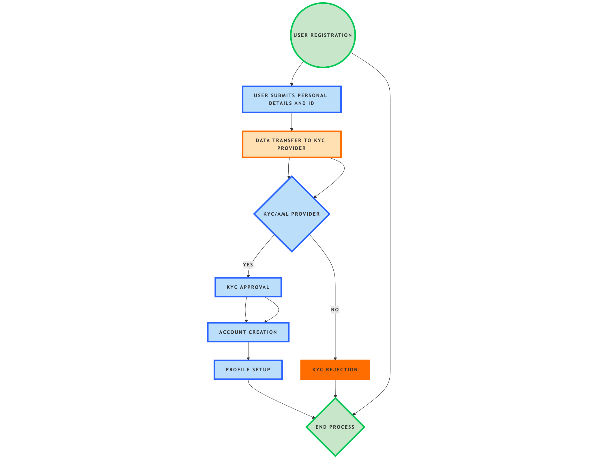
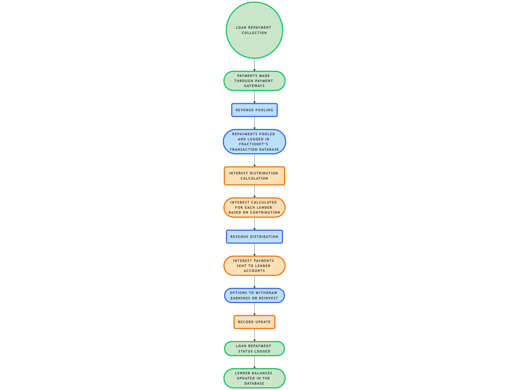

# Fractionet Documentation

Welcome to the **Fractionet Documentation Repository**. This repository contains all technical documentation, architecture diagrams, user flows, and data flows for the Fractionet platform. Each section below provides a deeper look into the system’s design and functionality.

## Table of Contents

- [Overview](#overview)
- [C4 Diagrams](#c4-diagrams)
  - [Context Diagram](#context-diagram)
  - [Container Diagram](#container-diagram)
  - [Component Diagram](#component-diagram)
  - [Code Diagram](#code-diagram)
- [User Flows](#user-flows)
  - [Investor Flow](#investor-flow)
  - [Borrower Flow](#borrower-flow)
  - [Lender Flow](#lender-flow)
- [Data Flows](#data-flows)
  - [Asset Tokenization Flow](#asset-tokenization-flow)
  - [User KYC and Onboarding Flow](#user-kyc-and-onboarding-flow)
  - [Loan Repayment and Revenue Distribution Flow](#loan-repayment-and-revenue-distribution-flow)
- [Usage Instructions](#usage-instructions)

---

## Overview

This documentation repository is intended for developers, contributors, and stakeholders interested in the technical design and architecture of the Fractionet platform. The documentation covers:

- **System Architecture**: High-level system design using C4 diagrams.
- **User Journeys**: Detailed user flows showing interactions for investors, borrowers, and lenders.
- **Data Handling**: Data flow diagrams to illustrate how data is managed and processed within Fractionet.

Each section provides diagrams and explanations to offer insights into Fractionet’s backend, frontend, and smart contract interactions.

---

## C4 Diagrams

The **C4 model** is used to illustrate Fractionet’s system architecture. This includes the Context, Container, Component, and Code diagrams.

### Context Diagram
- **Description**: The context diagram provides an overview of how the Fractionet platform interacts with external systems, users, and services.
- **Diagram**: 

### Container Diagram
- **Description**: The container diagram breaks down the main containers (frontend, backend, databases, and blockchain) and their interactions.
- **Diagram**: 

### Component Diagram
- **Description**: The component diagram provides a detailed view of the core services within the Fractionet platform, including User Management, Asset Tokenization, Loan Processing, and Rewards.
- **Diagram**: 

### Code Diagram
- **Description**: The code-level diagram details the key classes, functions, and smart contracts that enable Fractionet’s core functionality.
- **Diagram**: 

---

## User Flows

This section covers the **User Flows** for each user type on the Fractionet platform, showcasing typical interactions and experiences.

### Investor Flow
- **Description**: The investor flow illustrates the journey from registration to investment, including portfolio management and governance participation.
- **Diagram**: 

### Borrower Flow
- **Description**: The borrower flow outlines the process from loan application to repayment, including asset tokenization and funding.
- **Diagram**: 

### Lender Flow
- **Description**: The lender flow details how lenders select loans, fund projects, track interest payments, and participate in governance.
- **Diagram**: 

---

## Data Flows

The **Data Flows** section documents how data is handled, stored, and processed in key operations on the Fractionet platform.

### Asset Tokenization Flow
- **Description**: Shows the process of tokenizing assets, from data collection to minting and distribution of fractional ownership tokens.
- **Diagram**: 

### User KYC and Onboarding Flow
- **Description**: Details the KYC process for onboarding new users, including verification through third-party services and account activation.
- **Diagram**: 

### Loan Repayment and Revenue Distribution Flow
- **Description**: Illustrates how loan repayments are processed and revenue is distributed to lenders as interest payments.
- **Diagram**: 

---

## Usage Instructions

To view and understand each diagram:

1. **Navigate to the relevant folder**: Each folder (`C4_Diagrams`, `User_Flows`, `Data_Flows`) contains diagrams and any supporting documentation.
2. **Open the diagrams**: Click on the links above to view specific diagrams in each category.
3. **Use with the Wiki**: For further explanations of key features and processes, refer to the [Fractionet Wiki](https://github.com/Fractionet-official/Fractionet/wiki).

---

Each section in this documentation is designed to help stakeholders, developers, and contributors understand the architecture and inner workings of the Fractionet platform. If you have questions or suggestions for improving this documentation, please feel free to open an issue in the repository.
